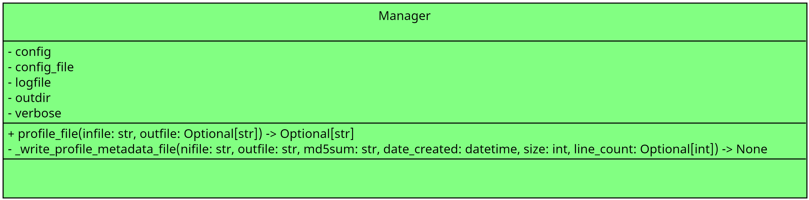

# data-file-profiler-utils
data-file-profiler-utils

- [data-file-profiler-utils](#data-file-profiler-utils)
  - [Motivation](#motivation)
  - [Improvements](#improvements)
  - [Use Cases](#use-cases)
  - [Class Diagrams](#class-diagrams)
  - [Installation](#installation)
  - [Usage](#usage)
  - [Contributing](#contributing)
  - [To-Do/Coming Next](#to-docoming-next)
  - [CHANGELOG](#changelog)
  - [License](#license)


## Motivation

Explain what the motivation was for developing this package OR<br>
explain how this package was improved after being forked.


## Improvements

Please see the [TODO](docs/TODO.md) for a list of upcoming improvements.


## Use Cases


## Class Diagrams



## Installation

Please see the [INSTALL](docs/INSTALL.md) guide for instructions.

## Usage

```python
from import data_file_profiler_utils import Manager as ProfileManager

pm = ProfileManager()
pm.profile_file("/tmp/patient002.vcf")
```

## Contributing

Pull requests are welcome. For major changes, please open an issue first
to discuss what you would like to change.

## To-Do/Coming Next

Please view the listing of planned improvements [here](docs/TODO.md).

## CHANGELOG

Please view the CHANGELOG [here](docs/CHANGELOG.md).

## License

[GNU AFFERO GENERAL PUBLIC LICENSE](docs/LICENSE)
